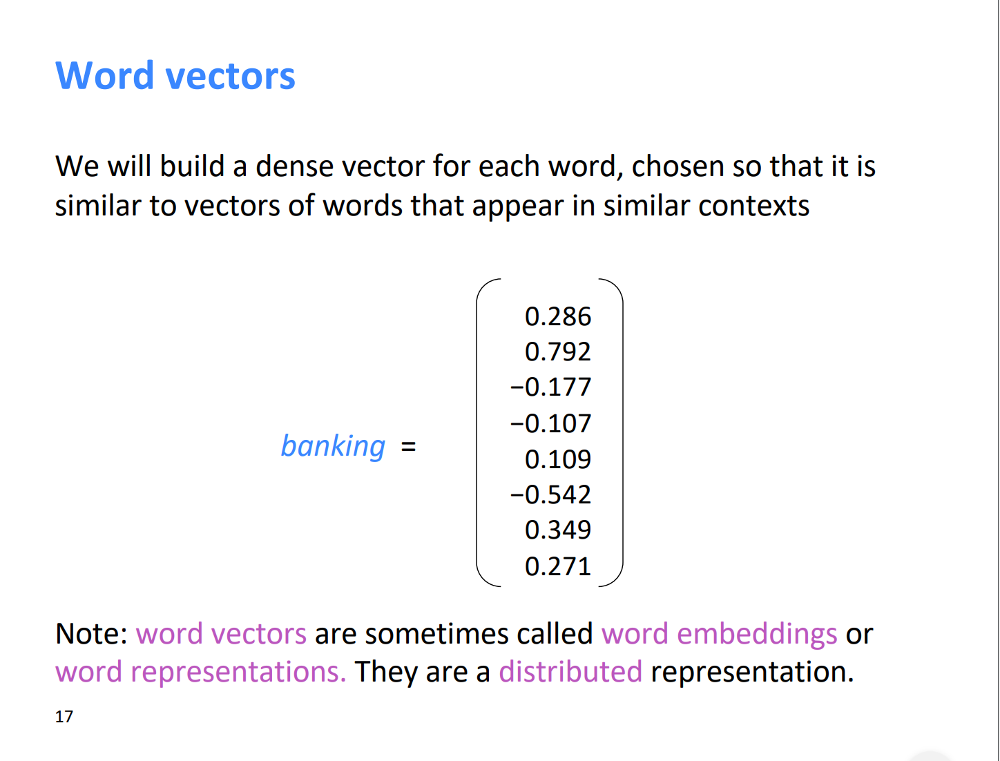
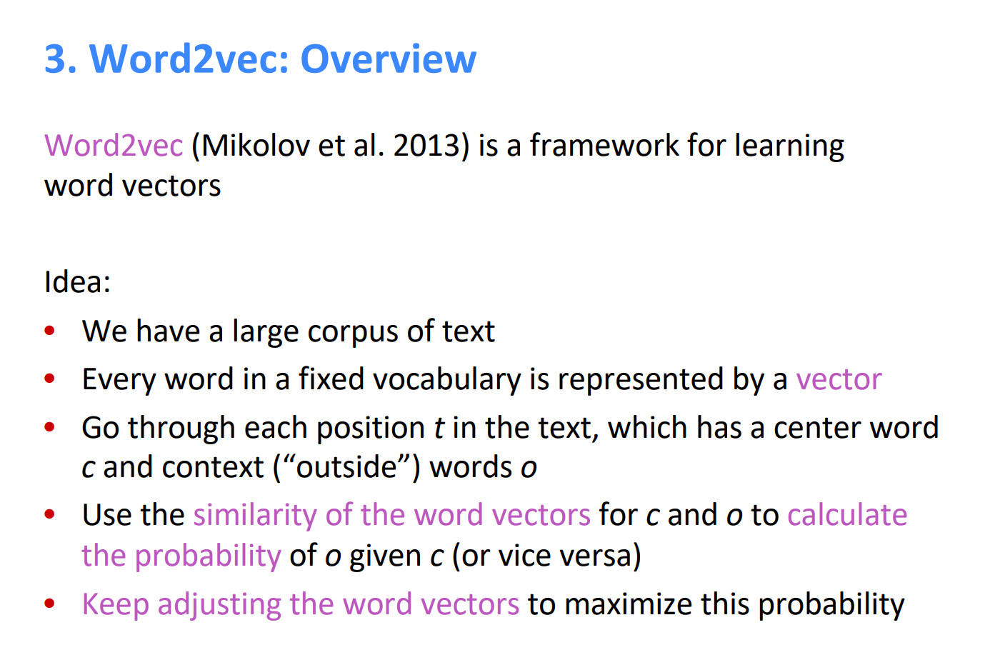

# Note of CS224N Lecture1: Introduction and word vectors

> School:  Stanford
>
> Teacher: Prof. Christopher Manning
>
> Library: Pytorch
>
> Course: [CS224n](https://web.stanford.edu/class/archive/cs/cs224n/cs224n.1194/index.html)

## 1. What's NLP?

#### a. Definition

Natural Language Processing(NLP for short),  is broadly defined as the automatic manipulation of natural language which refers to the way we humans communicate with each other, like speech and text, by software. 

#### b. Basic tasks

The study of NLP has been around for more than half a century, and the target of NLP is helping computers understand, interpret and manipulate human language, which isn't really solved. 

NLP includes many different techniques for interpreting human language, ranging from statistical and machine learning methods to rules-based and algorithmic approaches. We need a broad array of approaches because the text- and voice-based data varies widely, as do the practical applications. 

Basic NLP tasks include tokenization and parsing, lemmatization/stemming, part-of-speech tagging, language detection and identification of semantic relationships. If you ever diagramed sentences in grade school, you’ve done these tasks manually before. 

In general terms, NLP tasks break down language into shorter, elemental pieces, try to understand relationships between the pieces and explore how the pieces work together to create meaning.

##### 1. Content categorization

##### 2. Topic discovery and modeling

##### 3. Contextual extraction

##### 4. Sentiment analysis

##### 5. Speech-to-text and text-to-speech conversion

##### 6. Document summarization

##### 7. Machine translation

## 2. What's word vectors?

Obviously, the first step of all NLP tasks is how we represent words as input to any our models. Word vectors which are the texts converted into numbers and there may be different numerical representations of the same text, give a way to this problem. 

A Word vector format generally tries to map a word using a dictionary to a vector. Let us break this phrase down into finer details to have a clear view.

Take a look at this example - "The banking system is a basic system"; A dictionary may be the list of all unique words in the sentence. So, a dictionary may look like – [‘The’,’banking’,’system’,’is’,’a’,’basic’]. A vector representation of a word may be a one-hot encoded vector, like a vector show in above picture.

##### Different types of Word Vectors

The different types of word vectors can be broadly classified into two categories-

1. Frequency based
2. Prediction based

##### Word2vec

## 3. What's next?

I joined in a NLP learning activity held by an open-source organization [Datawhale](https://datawhale.club/) recently. We are gonna learning the awesome course [CS224n](https://web.stanford.edu/class/archive/cs/cs224n/cs224n.1194/index.html) by Stanford in this activity. 

I will keep updating my progress and my learning note in the upcoming posts on this blog. As a beginner of this field, I have a lot to learn. I may just follow the plan of this activity or this course to have a big picture of NLP. So, my next post may be the exploring of Word2vec.

## References

1. [NLP: What it is and why it matters](https://www.sas.com/en_us/insights/analytics/what-is-natural-language-processing-nlp.html#howitworks)

2. [An Intuitive Understanding of Word Embeddings: From Count Vectors to Word2Vec](https://www.analyticsvidhya.com/blog/2017/06/word-embeddings-count-word2veec/)

   

