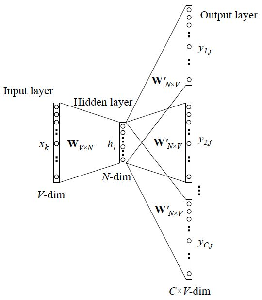

> Word2vec is a deep learning technique that feeds massive amounts of text into a shallow neural net which can then be used to solve a variety of NLP and ML problems. Usually, Word2vec Explorer uses [Gensim](https://github.com/piskvorky/gensim) to list and compare vectors. 

## 1. recommented refs of Word2vec

1. Mikolov's papers:
   1. [Distributed Representations of Sentences and Documents](https://arxiv.org/pdf/1405.4053.pdf) Word2vec, a more powerful language model framework, is proposed and used to generate word vectors.
   2. [Efficient estimation of word representations in vector space](https://arxiv.org/pdf/1301.3781.pdf) mainly about two tricks of word2vec: hierarchical softmax, negative sampling.
2. Yoav Goldberg's paper: [word2vec Explained: deriving Mikolov et al.'s negative-sampling word-embedding method](https://arxiv.org/pdf/1402.3722.pdf) good for learning more about the formula of negative sampling.
3. Xin Rong's paper: [word2vec Parameter Learning Explained](https://arxiv.org/pdf/1411.2738.pdf) highly recommented! There are both high-level intuition explanations and detailed derivation processes.
4. Siwei lai's paper: [Word and Document Embeddings based on Neural Network Approaches](https://arxiv.org/ftp/arxiv/papers/1611/1611.05962.pdf) 

## 2. Word2vec

### 2.1 what's Word2vec？

To perform NLP, we need to find a way to vectorise words so that we can input them into our machine. So we need word embedding, which can convert symbolic words into numerical forms, in other word, embedded into a mathematical space. And Word2vec is a kind of word embedding. 

Word2vec only care about the model parameters (specifically the weight of the neural network), and take these parameters as a kind of vectorized representation of the input word. That means we can use Word2vec to generate word vectors.

### 2.2 Skip-gram and CBOW

- **Skip-gram**: a model use a word as input to predict the context around it.
- **CBOW**: a model use the context around a word as input to predict the word itself.

#### 2.2.1 Skip-gram

we can take a look at the Skip-gram network structure:

which x is one-hot encoder which is a vector only containing one one and all other zeros and used to uniquely represent a word; y is the probability of these V words output as a group.

Let's notice this: **the activation function of the hidden layer is actually linear**, which the key method of Word2vec simplify the previous language model. And we use BP to train this neural network. After training, we got the weights of this net. Because only the weight corresponding to the different position of 1's is activated, this Vx which is consisted of the weights we got can be used to uniquely represent x.  And the dimension of Vx is generally far smaller than the total number of words V, so Word2vec is essentially a dimensionality reduction operation.

while y has multiple words, the network structure is as follows:

It can be seen as a parallel of a single x->single y model, and the cost function is the accumulation of a single cost function (after taking log). 

#### 2.2.2 CBOW

Similar to Skip-gram, except Skip-gram predicts the context of a word, and CBOW predicts the word using context.

Network structure is as follow:

It is different from the Skip-gram model in parallel. Here, the input becomes multiple words, so we need to process the input (generally sum and then average) first. The cost function of the output is unchanged. For detail you can read this paper: [word2vec Parameter Learning Explained](https://arxiv.org/pdf/1411.2738.pdf).

### 2.3 training tricks

Why do we need training tricks? As we just mentioned, Word2vec is essentially a language model, its output node number is V, corresponding to V words, which is essentially a multi-classification problem. But in reality, the number of words is very, very large. It will cause great difficulty in calculation, so we need to use tricks to accelerate the training.

Here are two tricks:

- hierarchical softmax: turn the N classification problem into log(N) secondary classification.

- negative sampling: predict a subset of the overall category.

## 3. References

##### 1. [Natural Language Processing1: Word To Vectors](https://billmazengou.github.io/2020/06/23/NLP1-Word-to-Vectors/)

##### 2. [Word2Vec Explorer](https://github.com/dominiek/word2vec-explorer)

##### 3. [Distributed Representations of Sentences and Documents](https://arxiv.org/pdf/1405.4053.pdf) 

##### 4. [Efficient estimation of word representations in vector space](https://arxiv.org/pdf/1301.3781.pdf)

##### 5.  [word2vec Explained: deriving Mikolov et al.'s negative-sampling word-embedding method](https://arxiv.org/pdf/1402.3722.pdf) 

##### 6. [word2vec Parameter Learning Explained](https://arxiv.org/pdf/1411.2738.pdf)

##### 7.  [Word and Document Embeddings based on Neural Network Approaches](https://arxiv.org/ftp/arxiv/papers/1611/1611.05962.pdf) 

