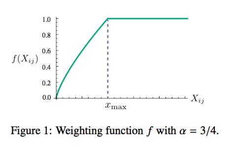
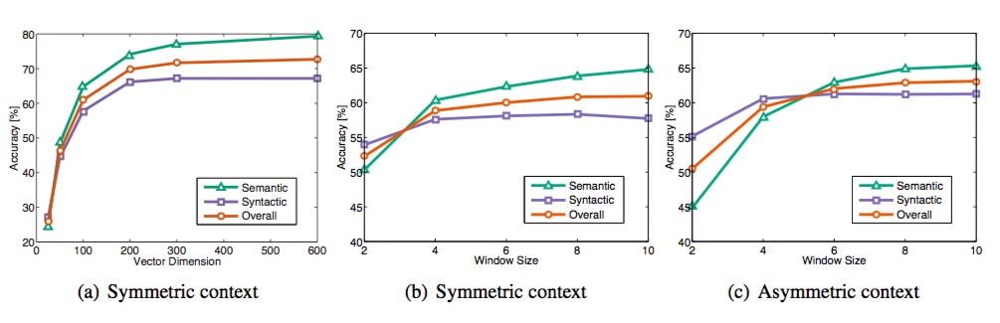

> School:  Stanford
>
> Teacher: Prof. Christopher Manning
>
> Library: Pytorch
>
> Course: [CS224n](https://web.stanford.edu/class/archive/cs/cs224n/cs224n.1194/index.html)

## 1. Global Vectors for Word Representation(GloVe)

### 1.1 What's GloVe?

GloVe is a word representation tool based on global word frequency (count-based & overall statistics). It can express a word into a vector of real numbers. These vectors some semantic characteristics between words are captured, such as similarity (analogity), analogy (analogy), etc. We can calculate the semantic similarity between two words through operations on vectors, such as Euclidean distance or cosine similarity.

### 1.2 How dose it work?

#### 1.2.1 Construct a co-occurrence matrix

According to the corpus to build a [co-occurrence matrix](http://www.fanyeong.com/2017/10/10/word2vec/) X, **Each element in the matrix \(X_{i,j}\) represents the number of times the word \(i\) and the context word \(j\) appear together in a context window of a certain size. **Generally speaking, the minimum unit of this number is 1, but GloVe does not think so: it proposes a decay function based on the distance between two words in the context window \(d\): \(decay = 1/d\) is used to calculate the weight, that is to say, **the farther away the two words, the smaller the weight of the total count**.

#### 1.2.2 Construct the approximate relationship between Word Vector and Co-occurrence Matrix

The author of the [paper](https://www.aclweb.org/anthology/D14-1162) proposes the following formula to approximate the relationship between the two:
$$
w_{i}^{T}\tilde{w_{j}} + b_i + \tilde{b_j} = \log(X_{ij}) \tag{1}
$$
Among them, $\(w_{i}^{T}\)$ and $ \( \tilde{ w_{j} }\) $ are the word vectors we finally need to solve; $ \(b_i\)$  and $ \(\tilde{b_j}\ ) $ Are the bias terms of the two word vectors.
Of course, you must have a lot of questions about this formula, such as how did it come from, why should you use this formula, and why should you construct two word vectors $ \(w_{i}^{T}\)$  and $ \(\tilde {w_{j}}\)$ ? We will introduce them in detail below.  

#### 1.2.3 Construct loss function

With formula (1), we can construct its loss function:
$$
J = \sum_{i,j=1}^{V} f(X_{ij})(w_{i}^{T}\tilde{w_{j}} + b_i + \tilde{b_j} – \log (X_{ij}) )^2 \tag{2}
$$
The basic form of this loss function is the simplest mean square loss, but on this basis, a weight function$  \(f(X_{ij})\) $ is added, then what role does this function play, why should this function be added What? We know that in a corpus, there must be a lot of words that they appear together frequently (frequent co-occurrences), then we hope:
1. The weight of these words is greater than the words that rarely appear together (rare co-occurrences), so if this function is a non-decreasing function (non-decreasing);
2. But we also don't want this weight to be overweighted, it should not increase after reaching a certain level;
3. If the two words do not appear together, that is, $ \(X_{ij}=0\)$ , then they should not participate in the calculation of the loss function, that is, $ \(f(x)\) $ must satisfy $ \(f(0)=0\)$ 
There are many functions that meet the above two conditions, and the author uses the following form of the piecewise function:
$$
f(x)=\begin{equation}
\begin{cases}
(x/x_{max})^{\alpha} & \text{if} \ x <x_{max} \\
1 & \text{otherwise}
\end{cases}
\end{equation} \tag{3}
$$
The function image is shown below:

In all experiments in this paper, the value of $ \(\alpha\) $ is 0.75, and the value of $ \(x_{max}\)$  is 100. The above is the implementation details of GloVe, so how does GloVe train?

#### 1.2.4 Train GloVe Model

Although many people claim that GloVe is an unsupervised learning method (because it does not require manual labeling), it actually has a label. This label is the $ \(\log(X_{ in formula (2) ij})\)$ , and the vectors $ \(w\)$  and $ \(\tilde{w}\)$  in formula 2 are the parameters that need to be continuously updated/learned, so in essence its training method is no different from the supervised learning training method Not the same, all based on gradient descent. Specifically, the experiment in this paper is done as follows: AdaGrad's gradient descent algorithm is used to randomly sample all non-zero elements in the matrix $ \(X\)$ , and the learning curvature is set to 0.05. If the vector size is less than 300, iterate 50 times, and vectors of other sizes iterate 100 times until convergence. The final learning is that the two vectors are $ \(w\)$  and $ \(\tilde{w}\)$ , because \(X\) is symmetric, so in principle $ \(w\)$  and $ \(\tilde{w}\)$  is also symmetrical, the only difference between them is that the initial values are different, which leads to different final values. So these two are actually equivalent and can be used as the final result. But in order to improve the robustness, we will eventually choose the sum of the two $ \(w + \tilde{w}\)$  as the final vector (different initialization of the two is equivalent to adding different random noise, so it can improve the robustness Sex). After training a corpus of 40 billion tokens, the experimental results obtained are shown below:

There are three indicators used in this graph: semantic accuracy, grammatical accuracy, and overall accuracy. Then it is not difficult to find that Vector Dimension can achieve the best at 300, and the context Windows size is roughly between 6 and 10.

## 2. Evaluation of Word Vectors

In this section, we discuss how we can quantitatively evaluate the quality of word vectors produced by such techniques.

### 2.1 Intrinsic Evaluation

Intrinsic evaluation of word vectors is the evaluation of a set of word vectors generated by an embedding technique (such as Word2Vec or GloVe) on specific intermediate subtasks (such as analogy completion). These subtasks are typically simple and fast to compute and thereby allow us to help understand the system used to generate the word vectors. An intrinsic evaluation should typically return to us a number that indicates the performance of those word vectors on the evaluation subtask.

Motivation: Let us consider an example where our final goal is to create a question answering system which uses word vectors as inputs. One approach of doing so would be to train a machine learning system that:

1. Takes words as inputs 
2. Converts them to word vectors 
3. Uses word vectors as inputs for an elaborate machine learning system 
4. Maps the output word vectors by this system back to natural language words 
5. Produces words as answers

Of course, in the process of making such a state-of-the-art question-answering system, we will need to create optimal word-vector representations since they are used in downstream subsystems (such as deep neural networks). To do this in practice, we will need to tune many hyperparameters in the Word2Vec subsystem (such as the dimension of the word vector representation). While the idealistic approach is to retrain the entire system after any parametric changes in the Word2Vec subsystem, this is impractical from an engineering standpoint because the machine learning system (in step 3) is typically a deep neural network with millions of parameters that takes very long to train. In such a situation, we would want to come up with a simple intrinsic evaluation technique which can provide a measure of "goodness" of the word to word vector subsystem. Obviously, a requirement is that the intrinsic evaluation has a positive correlation with the final task performance.

### 2.2 Extrinsic Evaluation

Extrinsic evaluation of word vectors is the evaluation of a set of word vectors generated by an embedding technique on the real task at hand. These tasks are typically elaborate and slow to compute. Using our example from above, the system which allows for the evaluation of answers from questions is the extrinsic evaluation system. Typically, optimizing over an underperforming extrinsic evaluation system does not allow us to determine which specific subsystem is at fault and this motivates the need for intrinsic evaluation.

### 2.3 Summary

##### Intrinsic Evaluation:

- Evaluate specific intermediate tasks
- Faster calculation speed
- Help understand the subsystem
- Need to be positively correlated with actual tasks to determine usefulness

##### Extrinsic Evaluation

- an Evaluation of the real task
- Computing performance may be slow
- It is unclear whether the subsystem is the problem, or other subsystems, or internal interactions
- If replacing the subsystem can improve performance, then the change may be good

## 3. Training for Extrinsic Tasks

We have so far focused on intrinsic tasks and emphasized their importance in developing a good word embedding technique. Of course, the end goal of most real-world problems is to use the resulting word vectors for some other extrinsic task. Here we discuss the general approach for handling extrinsic tasks.

### 3.1 Problem Formulation

Most NLP extrinsic tasks can be formulated as classification tasks. For instance, given a sentence, we can classify the sentence to have positive, negative or neutral sentiment. Similarly, in named-entity recognition (NER), given a context and a central word, we want to classify the central word to be one of many classes.

In typical machine learning tasks, we usually hold input data and target labels fixed and train weights using optimization techniques (such as gradient descent, L-BFGS, Newton’s method, etc.). In NLP applications however, we introduce the idea of retraining the input word vectors when we train for extrinsic tasks. Let us discuss when and why we should consider doing this.

### 3.2 Retraining Word Vectors

### 3.3 Softmax Classification and Regularization

### 3.4 Window Classification

### 3.5 Non-linear Classifiers

### 4. References

##### 1. [GloVe: Global Vectors for Word Representation](https://www.aclweb.org/anthology/D14-1162)

##### 2. [GloVe详解](http://www.fanyeong.com/2018/02/19/glove-in-detail/)

##### 3. [cs224n-2019-notes02-wordvecs2](https://github.com/datawhalechina/team-learning/tree/master/04%20%E8%87%AA%E7%84%B6%E8%AF%AD%E8%A8%80%E5%A4%84%E7%90%86/Lecture/Lecture2/official_notes/cs224n-2019-notes02-wordvecs2.pdf)

