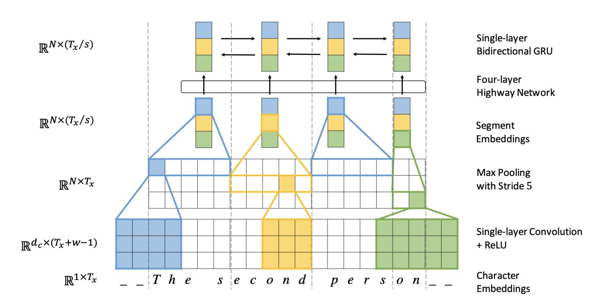

## 1. Introduction

The Word2vec model and GloVe model mentioned in the previous posts are basically based on the word which means word as the basic unit. But theirs disadvantage is that they cannot solve the out-of-vocabulary(OOV for short) that the word is not in the vocabulary. And they have a bad performance on processing the morphology.

Let's take a look at these:

### 1.1 Word-Level Model

Based on the basic unit -- word, this method can well represent each word as a  vector in the vocabulary. Its disadvantages are as follow:

#### 1.1.1 OOV

- Problem: It's easy to appear that the word we want doesn't in the vocabulary;
- Solution: Add more words into vocabulary

#### 1.1.2 Improper spelling

- Problem: The system is difficult to deal with the word which has unofficial spelling.
- Solution: Correct the wrong spelling word or add rule constraints.

#### 1.1.3 Name Translation

- Problem: It's difficult to transliterate names.
- Solution: Add rule constrains.

### 1.2 Character-Level Model

Based on character as the basic unit, this method can well vectorize each Char in the font. It's good at solving OOV problems and having similar embedding among the words that have similar spelling.

#### Problem:

Compared to word-level, character-level input sentences become longer, making the data sparse, and the dependence on long distance is difficult to learn, and the training speed is reduced.

#### Solution:

[Fully Character-Level Neural Machine Translation without Explicit Segmentation](https://arxiv.org/abs/1610.03017) introduced a way which uses multiple layers of convolution, pooling and highway layer to solve this problem. The structure of the encoder is shown below:

And how it works:

1. The input characters first need to go through the Character embedding layer and be converted into character embeddings representation;
2. Convolution kernels with different window sizes are used to perform the convolution operation on the character embeddings of the input characters. The sizes of the windows used in the paper are 3, 4 and 5, respectively, that is, to learn Character-level 3-gram, 4-gram, 5-gram;
3. Perform max-pooling operations on the convolution results of different convolutional layers, that is, capture its most significant features to generate segment embedding;
4. The segment embedding passes through the Highway Network (some similar to the Residual network, which facilitates the flow of information in the deep network, but some gates are added to control the flow of information);
5. The output results go through the single layer BiGRU to get the final encoder output;
6. The decoder uses the Attention mechanism and character level GRU to decode it.

The experimental results show that the character-based model can better handle the OOV problem, and for multi-language scenarios, it can better learn the common morphemes among languages. And it can capture the 3-gram, 4-gram, 5-gram information of the sentence, which is also the prototype of the idea of FastText later.

### 1.3 Subword Model

Subword model is a model created by taking a component between characters and words as the basic unit. It is divided into Byte Pair Encoding (BPE) and SentencePiece. 

## 2. Sub-word Model

Sub-word model has now become an important NLP model performance improvement method. Since BERT was born in 2018 and swept through the major rankings in the NLP world, various pre-trained language models have emerged like mushrooms, among which the Sub-word model has become a standard. And it has great advantages compared with the traditional space separation tokenization technology.

### 2.1 Byte Pair Enconding(BPE)

BPE is one of the compression algorithms. The main idea is to replace the frequently occurring byte pair with a new byte. For example, if ('A','B') appears frequently in sequence, then use a new flag ('AB') To replace them. 

Given a text library, our initial vocabulary contains only all single characters, and then continuously add the n-gram pair with the highest frequency as a new n-gram to the vocabulary until the size of the vocabulary reaches a certain goal we set.

Google's NMT model also evolved from BPE, one called word-piece model and one called sentence-piece model. The word-piece model does not select the n-gram with the highest frequency each time, but selects the n-gram that can reduce the complexity of the language model each time. 

### 2.2 Sentence-Piece

The sentence-piece model regards the gap between words as a word, so that the entire sentence can be directly processed without preprocessing into words and then embedding.

## 3. Hybrid character and word-level models

The key idea: most of the time, the word-level model is used for translation. Only when the words of rare or unseen are encountered, the character-level model will be used to assist. This approach has produced very good results.

## 4. References

##### 1. [Achieving Open Vocabulary Neural Machine Translation with Hybrid Word-Character Models](https://arxiv.org/abs/1604.00788v1)

##### 2.[Fully Character-Level Neural Machine Translation without Explicit Segmentation](https://arxiv.org/abs/1610.03017)

##### 3. [Enriching Word Vectors with Subword Information](https://arxiv.org/pdf/1607.04606.pdf)

