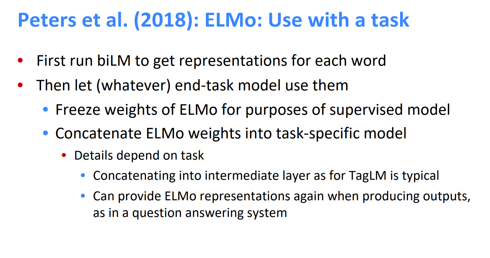
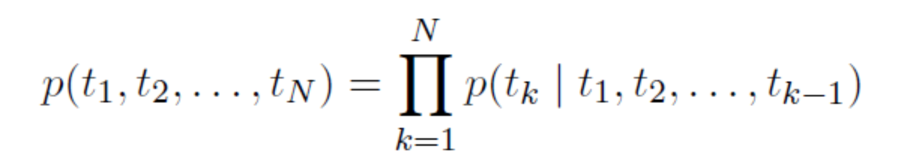
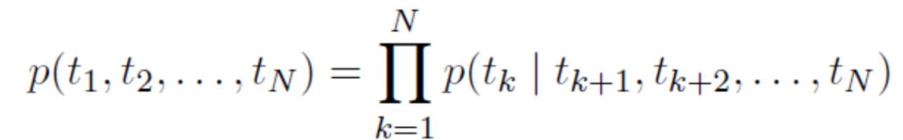
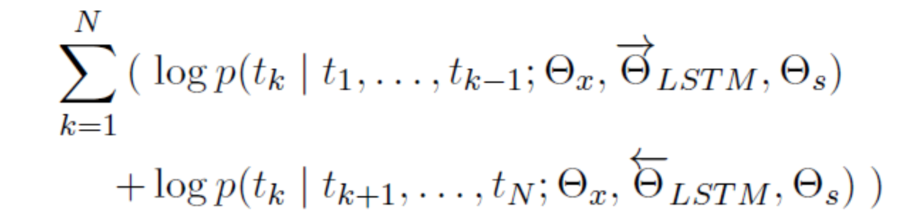
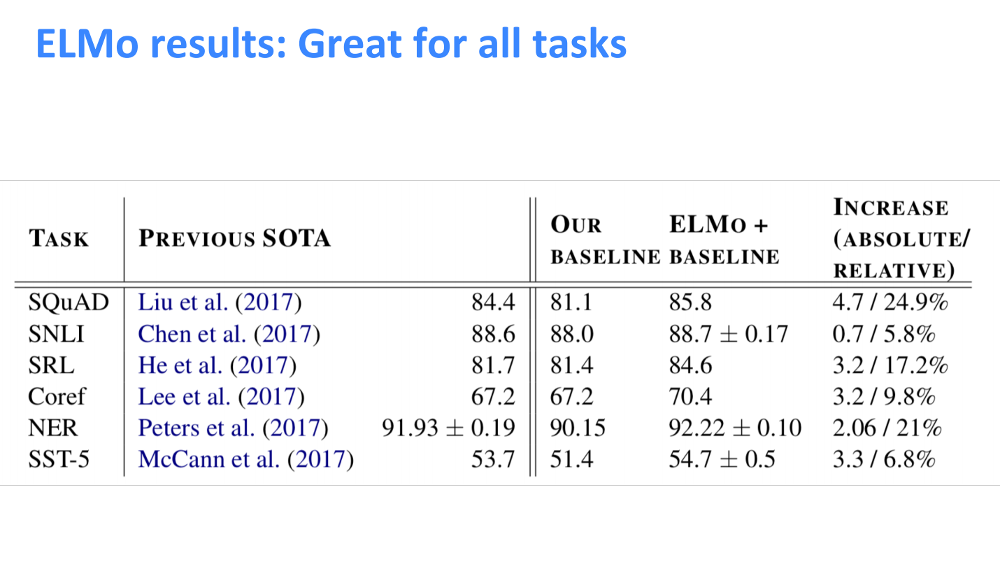
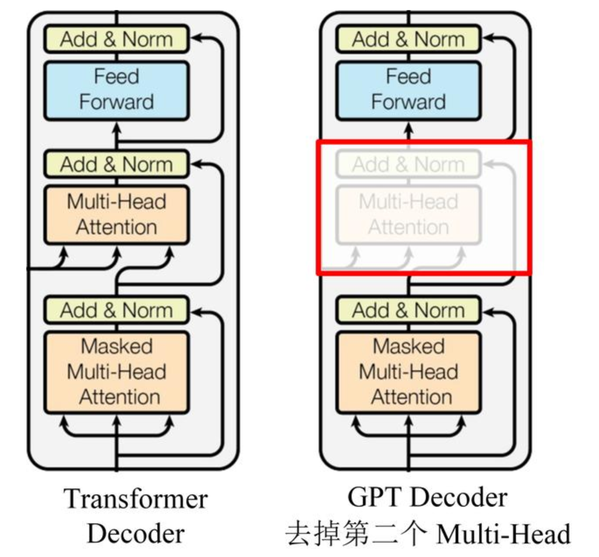
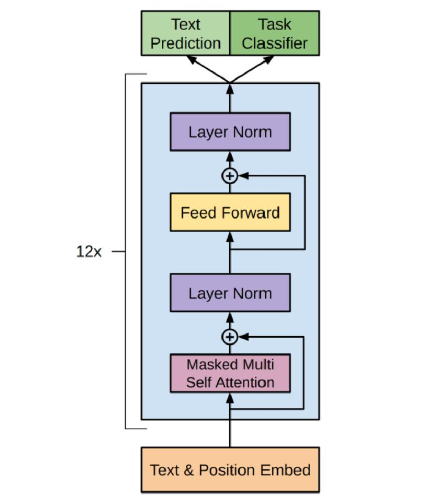
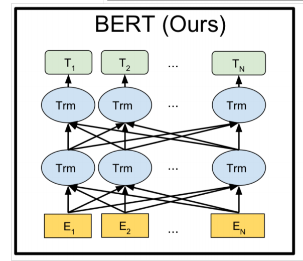

## 1. ELMo

In the previous work of word2vec and GloVe, each word corresponds to a vector, which is powerless for polysemous words. And as the language environment changes, these vectors cannot accurately express the corresponding features. The authors of ELMo believe that a good word representation model should take into account two issues at the same time: one is the complex semantic and grammatical characteristics of word usage; and the other is that these usages should change with the change of language environment.

**The characteristics of ELMo** : the representation of each word is a function of the entire input sentence. 

### 1.1 How ELMo works

1. Pre-train biLM models on large corpora. The model is composed of two layers of bi-LSTM, and the models are connected by residual connection. Moreover, the author believes that the low-level bi-LSTM layer can extract the syntactic information in the corpus, and the high-level bi-LSTM can extract the semantic information in the corpus.
2. In our training corpus (removing labels), fine-tuning the pre-trained biLM model. This step can be seen as the domain transfer of biLM.
3. The word embedding generated by ELMo is used as the input of the task, and sometimes it can be added both during input and output.

ELMo got its name (Embeddings from Language Models). In order to be used in downstream NLP tasks, generally use the corpus of downstream tasks (note that the label is omitted here) to fine-tune the language model. This fine-tuning is equivalent to a domain transfer; then use the label information for supervised learning.

### 1.2 Bidirectional language models

ELMo, as the name implies, is embeddings from Language Models, to be precise from Bidirectional language models. It can be expressed as:

**Forward LSTM structure:**

**Reverse LSTM structure:**

**Maximum likelihood function:**

### 1.3 summary

In general, ELMo provides dynamic representation at the word level, which can effectively capture contextual information and solve the problem of polysemy.

## 2. GPT

### 2.1 Introduce

OpenAI proposed the GPT model in the paper "Improving Language Understanding by Generative Pre-Training", and later proposed the GPT2 model in the paper "Language Models are Unsupervised Multitask Learners". The model structure of GPT2 and GPT is not much different, but a larger data set is used for the experiment.

The training method adopted by GPT is divided into two steps. The first step is to train the language model using an unlabeled text data set. The second step is to fine-tune the model according to specific downstream tasks, such as QA, text classification, etc.

### 2.2 Structure

GPT uses Transformer's Decoder structure and makes some changes to Transformer Decoder. The original Decoder contains two Multi-Head Attention structures, and GPT only retains Mask Multi-Head Attention.

The following figure is the overall model of GPT, which contains 12 Decoders:

### 2.3 Summary

The GPT pre-training uses the above to predict the next word. GPT is more suitable for the task of text generation, because text generation is usually based on the information currently available to generate the next word.

## 3. BERT

### 3.1 Introduce

BERT(Bidirectional Encoder Representation from Transformers) is the encoder of the bidirectional Transformer. The model architecture of BERT is based on multi-layer bidirectional conversion decoding. Because the decoder cannot obtain the information to be predicted, the main innovation of the model is in the pre-traing method, Which uses Masked LM and Next Sentence Prediction to capture word and sentence level representation respectively.

"Bidirectional" means that when the model is processing a certain word, it can use both the previous word and the following words. BERT is different from the traditional language model. It is not giving you all the previous words so that you can predict the most probable current word, but covering some words at random, and then use all the words that are not covered to make predictions.

### 3.2 Structure

BERT provides a simple and a complex model, the corresponding hyperparameters are as follows:

**BERT-base**: L=12, H=768, A=12, total parameter 110M;
**BERT-large**: L=24, H=1024, A=16, the total amount of parameters is 340M;
In the above hyperparameters, L represents the number of layers of the network (the number of Transformer blocks), A represents the number of self-Attention in Multi-Head Attention, and the filter size is 4H.

### 3.3 Pre-train task

BERT is a multi-task model. Its task is composed of two self-supervised tasks, namely MLM and NSP.

#### 3.3.1 Task #1： Masked Language Model

Masked Language Model (MLM) core idea is taken from a paper published by Wilson Taylor in 1953. It refers to masking some words from the input expectations during training, and then predicting the words through the context. This task is very similar to the cloze that we often do in middle school. Just like traditional language model algorithms and RNN matching, this property of MLM matches the structure of Transformer very well.

#### 3.3.2 Task #2: Next Sentence Prediction

The task of Next Sentence Prediction (NSP) is to determine whether sentence B is the following of sentence A. If yes, output **"IsNext"**, otherwise output **"NotNext"**. The training data is generated by randomly extracting two consecutive sentences from the parallel corpus, of which 50% retain the two extracted sentences, which are in accordance with the **IsNext** relationship, and the other 50% of the second sentence is randomly extracted from the expected, they The relationship is **NotNext**. 

## 4. References

##### 1. [Deep contextualized word representations](https://arxiv.org/pdf/1802.05365.pdf) 

##### 2. [Improving Language Understanding by Generative Pre-Training](https://s3-us-west-2.amazonaws.com/openai-assets/research-covers/language-unsupervised/language_understanding_paper.pdf) 

##### 3. [OpenAI GPT 和 GPT2 模型详解](https://baijiahao.baidu.com/s?id=1652093322137148754) 

##### 4. [BERT: Pre-training of Deep Bidirectional Transformers for Language Understanding](https://arxiv.org/pdf/1810.04805.pdf) 

##### 5. [BERT详解](https://zhuanlan.zhihu.com/p/48612853) 

