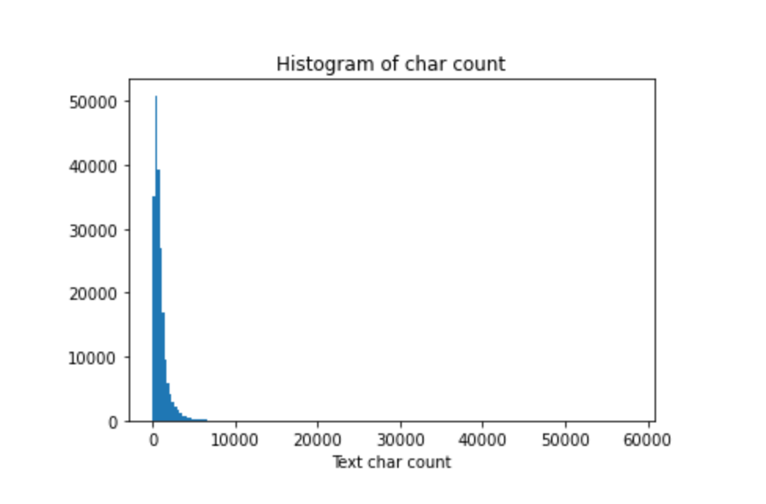

## 1. Read Dataset

The dataset is stored in csv format, we can use pandas to read it. The `read_csv`  function in pandas has three parameter assignments here:

- The read file path,  you can use a relative path or an absolute path;
- Separator sep, which is the character to be divided in each column, just set to '`\t`;
- The number of rows read, `nrows`, is the number of rows of the file read this time, which is a numeric type;

```python
import pandas as pd
train_df = pd.read_csv('/kaggle/input/newsclassestestdata/train_set.csv/train_set.csv', sep='\t')
train_df.head()
```

output:


## 2. Analysis

### 2.1 Sentence length analysis

In this question, the characters of each line of sentences are separated by spaces, so you can directly count the number of words to get the length of each sentence. The statistics are as follows:

```python
%pylab inline
train_df['text_len'] = train_df['text'].apply(lambda x: len(x.split(' ')))
print(train_df['text_len'].describe())
```

output:


The statistics of news sentences can be concluded that the text given in this contest is relatively long, each sentence is composed of about 907 characters on average, the shortest sentence length is 2, and the longest sentence length is 57921.

The following figure draws a histogram of sentence length:

```python
_ = plt.hist(train_df['text_len'], bins=200)
plt.xlabel('Text char count')
plt.title("Histogram of char count")
```



It can be seen that the length of most sentences is within 2000.


### 2.2 News category distribution

Next, you can perform distribution statistics on the categories of the data set, and specifically count the number of samples of each type of news.

```python
train_df['label'].value_counts().plot(kind='bar')
plt.title('News class count')
plt.xlabel("category")
```

output:


The corresponding relationship of the labels in the data set is as follows: 

> {'Technology': 0,'Stocks': 1,'Sports': 2,'Entertainment': 3,'Current Affairs': 4,'Society': 5,'Education' : 6,'Finance': 7,'Home Furnishing': 8,'Game': 9,'Property': 10,'Fashion': 11,'Lottery': 12,'Constellation': 13}

It can be seen from the statistical results that there is a relatively uneven distribution of the data set categories of the competition questions. In the training set, technology news is the most, followed by stock news, and the least news is constellation news.

### 2.3 Character distribution statistics

##### 2.3.1 Count the number of occurrences of each character：

```python
from collections import Counter
all_lines = ' '.join(list(train_df['text']))
word_count = Counter(all_lines.split(" "))
word_count = sorted(word_count.items(), key=lambda d:d[1], reverse = True)

print(len(word_count))
print(word_count[0])
print(word_count[-1])
```

output:


##### 2.3.2 Count the number of times different characters appear in sentences:

```python
train_df['text_unique'] = train_df['text'].apply(lambda x: ' '.join(list(set(x.split(' ')))))
all_lines = ' '.join(list(train_df['text_unique']))
word_count = Counter(all_lines.split(" "))
word_count = sorted(word_count.items(), key=lambda d:int(d[1]), reverse = True)

print(word_count[0])
print(word_count[1])
print(word_count[2])
```

output:


We can see that the coverage of characters 3750, characters 900 and characters 648 in 20w news is close to 99%, most likely they are punctuation marks.

##### 2.3.3 Assuming that character 3750, character 900 and character 648 are sentence punctuation marks, let's take a look at how many sentences each news article has on average:

```python
train_df['sentence_count1'] = train_df['text'].apply(lambda x: len(x.split('3750')))
train_df['sentence_count2'] = train_df['text'].apply(lambda x: len(x.split('900')))
train_df['sentence_count3'] = train_df['text'].apply(lambda x: len(x.split('648')))
train_df['sentence_count'] = train_df['text'].apply(lambda x: len(x.split('3750|900|648')))
print(train_df['sentence_count1'].describe())
print(train_df['sentence_count2'].describe())
print(train_df['sentence_count3'].describe())
print(train_df['sentence_count'].describe())
```

output:


We can see that the average length of the sentence is about 30 characters.

##### 2.3.4 Count the most frequent characters in each type of news:

```python
for i in range(14):
    all_lines = ' '.join(train_df[train_df['label']==i]['text'])
    word_count = Counter(all_lines.split(" "))
    word_count = sorted(word_count.items(), key=lambda d: int(d[1]), reverse = True)

    print(i,word_count[0])
```

output:


now we can tell the character `3750` is probably a punctuation mark!

## 3. summary

Through the above analysis, we can draw the following conclusions:

- The 1,000 sentences selected in the contest question contain an average of 904 characters per news, and some news characters are longer;
- The distribution of news categories in the contest questions is uneven, the sample size of stock news is close to more than 200, and the sample size of lottery news is less than 10;
- A total of nearly 4000 characters are included in the 1000 sentences of news;
  ‘3750’, ‘900’, and ‘648’ appear the most often, and it is inferred that they may be punctuation marks.
- The average number of characters in each news item is large and may need to be truncated;
- Due to the imbalance of the categories, it will seriously affect the accuracy of the model;
- For further optimization, hope to infer stop words and remove noise;
- Try to see if adding a clean data set can enhance the effect.