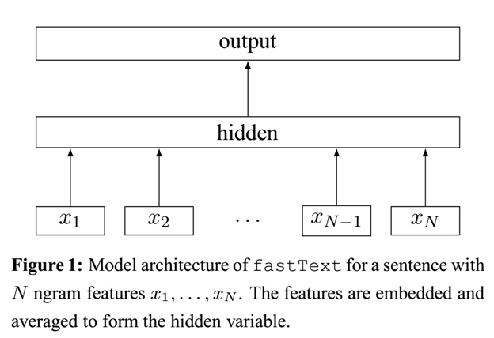

## 1. What FastText is

FastText is a word vector calculation and text classification tool open sourced by Facebook in 2016. It is not academically innovative. But its advantages are also very obvious. In text classification tasks, FastText can often achieve accuracy comparable to that of deep networks, but the training time is many orders of magnitude faster than deep networks. On a standard multi-core CPU, the word vectors of a 1 billion word-level corpus can be trained in 10 minutes, and more than 500,000 sentences with more than 300,000 categories can be classified in 1 minute!

### 1.1 model architecture

The fastText model architecture is very similar to the CBOW model architecture of word2vec. The following is a diagram of the fastText model architecture:



**Like CBOW, the FastText model has only three layers: input layer, hidden layer, and output layer (Hierarchical Softmax)**. The input is multiple words represented by vectors, the output is a specific target, and the hidden layers are all right The superposition average of multiple word vectors. The difference is that the input of CBOW is the context of the target word, the input of FastText is multiple words and their n-gram features, which are used to represent a single document; the input word of CBOW is encoded by one-hot, and the input feature of FastText is Embedding has been done; the output of CBOW is the target vocabulary, and the output of FastText is the class label corresponding to the document.

It is worth noting that FastText uses the character-level n-gram vector of the word as an additional feature when input; and FastText uses hierarchical Softmax when output, which greatly reduces the model training time.

### 1.2 key idea

what is the key idea of FastText? Carefully observe the second half of the model, from the output of the hidden layer to the output of the output layer. **You will find that it is a softmax linear multi-class classifier**. The input of the classifier is a vector used to characterize the current document; the first half of the model, That is, from the input of the input layer to the output of the hidden layer, it is mainly doing one thing: **generating a vector used to characterize the document**. So how does it do it? Superimpose all the words and n-gram word vectors that make up this document, and then take the average. The idea behind superimposing word vectors is the traditional bag-of-words method, which treats a document as a collection of words.

**So the key idea of FastText is**: superimpose and average the words and n-gram vectors of the entire document to get the document vector, and then use the document vector to do softmax multi-classification. This involves two techniques: the introduction of character-level n-gram features and hierarchical Softmax classification.


## 2. Text Classification with FastText

```python
import fasttext
import pandas as pd
from sklearn.metrics import f1_score
 
train_df = pd.read_csv('/kaggle/input/newsclassestestdata/train_set.csv/train_set.csv', sep='\t') 
train_df['label_ft'] = '__label__' + train_df['label'].astype(str)
 
train_df[['text','label_ft']].iloc[:-5000].to_csv('train.csv', index=None, header=None, sep='\t')
 
model = fasttext.train_supervised('train.csv', lr=1.0, wordNgrams=2, \
                                  verbose=2, minCount=1, epoch=25, loss="hs")
 
val_pred = [model.predict(x)[0][0].split('__')[-1] for x in train_df.iloc[-5000:]['text']] 
print(f1_score(train_df['label'].values[-5000:].astype(str), val_pred, average='macro'))
```

**output**: 0.9094285991495592

## 3. References

##### 1. [fastText原理及实践](https://zhuanlan.zhihu.com/p/32965521) 

##### 2. [Bag of Tricks for Efficient Text Classification](https://arxiv.org/abs/1607.01759) 

