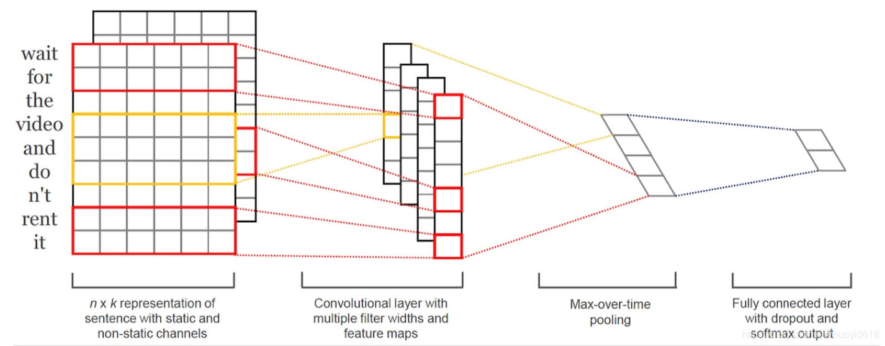
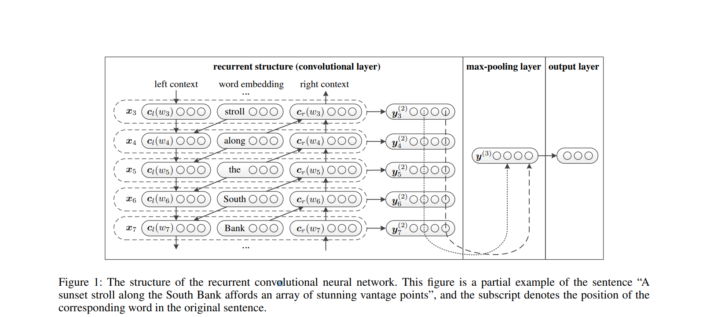
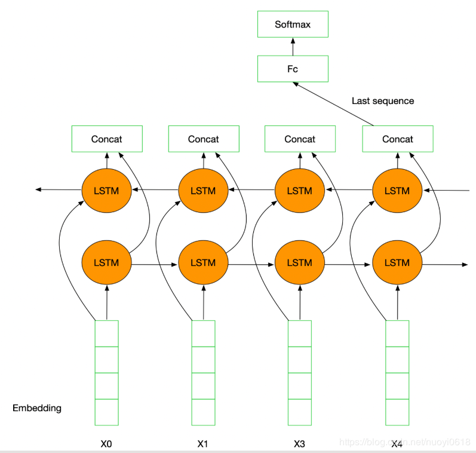

## 1. TextCNN

### 1.1 What TextCNN is

#### 1.1.1 Paper

Yoon Kim proposed TextCNN in the paper (2014 EMNLP) [Convolutional Neural Networks for Sentence Classification](https://arxiv.org/abs/1408.5882).

The convolutional neural network CNN is applied to text classification tasks, and multiple kernels of different sizes are used to extract key information in sentences (similar to n-grams with multiple window sizes), so as to better capture local correlations.

#### 1.1.2 Network Structure

The structure is as follow:



The schematic diagram is as follows:


1. **Embedding**: The first layer is the 7 by 5 sentence matrix on the leftmost side of the picture. Each row is a word vector with dimension = 5. This can be analogous to the original pixels in the image.
2. **Convolution**: Then go through a one-dimensional convolutional layer with kernel_sizes=(2,3,4), each kernel_size has two output channels.
3. **MaxPolling**: The third layer is a 1-max pooling layer, so that sentences of different lengths can become fixed-length representations after passing through the pooling layer.
4. **FullConnection and Softmax**: Finally, a fully connected softmax layer is connected to output the probability of each category.

### 1.2 Practice

```python
import logging

from keras import Input
from keras.layers import Conv1D, MaxPool1D, Dense, Flatten, concatenate, Embedding
from keras.models import Model
from keras.utils import plot_model


def textcnn(max_sequence_length, max_token_num, embedding_dim, output_dim, model_img_path=None, embedding_matrix=None):
    """ TextCNN: 1. embedding layers, 2.convolution layer, 3.max-pooling, 4.softmax layer. """
    x_input = Input(shape=(max_sequence_length,))
    logging.info("x_input.shape: %s" % str(x_input.shape))  # (?, 60)

    if embedding_matrix is None:
        x_emb = Embedding(input_dim=max_token_num, output_dim=embedding_dim, input_length=max_sequence_length)(x_input)
    else:
        x_emb = Embedding(input_dim=max_token_num, output_dim=embedding_dim, input_length=max_sequence_length,
                          weights=[embedding_matrix], trainable=True)(x_input)
    logging.info("x_emb.shape: %s" % str(x_emb.shape))  # (?, 60, 300)

    pool_output = []
    kernel_sizes = [2, 3, 4] 
    for kernel_size in kernel_sizes:
        c = Conv1D(filters=2, kernel_size=kernel_size, strides=1)(x_emb)
        p = MaxPool1D(pool_size=int(c.shape[1]))(c)
        pool_output.append(p)
        logging.info("kernel_size: %s \t c.shape: %s \t p.shape: %s" % (kernel_size, str(c.shape), str(p.shape)))
    pool_output = concatenate([p for p in pool_output])
    logging.info("pool_output.shape: %s" % str(pool_output.shape))  # (?, 1, 6)

    x_flatten = Flatten()(pool_output)  # (?, 6)
    y = Dense(output_dim, activation='softmax')(x_flatten)  # (?, 2)
    logging.info("y.shape: %s \n" % str(y.shape))

    model = Model([x_input], outputs=[y])
    if model_img_path:
        plot_model(model, to_file=model_img_path, show_shapes=True, show_layer_names=False)
    model.summary()
    return model
```


## 2. TextRNN



TextRNN uses RNN (recurrent neural network) for text feature extraction. Since text itself is a sequence, LSTM is naturally suitable for modeling sequence data. TextRNN inputs the word vector of each word in the sentence to the bidirectional double-layer LSTM in turn, and stitches the hidden layer at the last valid position in the two directions into a vector as the representation of the text.



Introduce bidirectional LSTM for classification; the general process is:

1.  embeddding layer;
2. Bi-LSTM layer;
3. concat output;
4. FC layer;
5. softmax;

##### practice

```python
import numpy as np

from keras.preprocessing import sequence
from keras.models import Sequential
from keras.layers import Dense, Dropout, Embedding, LSTM, Bidirectional
from keras.datasets import imdb


max_features = 20000
maxlen = 100
batch_size = 32

(x_train, y_train), (x_test, y_test) = imdb.load_data(num_words=max_features)
print('train sequences size:', len(x_train))
print('test sequences size:', len(x_test))

x_train = sequence.pad_sequences(x_train, maxlen=maxlen)
x_test = sequence.pad_sequences(x_test, maxlen=maxlen)
print('x_train shape:', x_train.shape)
print('x_test shape:', x_test.shape)
y_train = np.array(y_train)
y_test = np.array(y_test)

model = Sequential()
model.add(Embedding(max_features, 128, input_length=maxlen))
model.add(Bidirectional(LSTM(64)))
model.add(Dropout(0.5))
model.add(Dense(1, activation='sigmoid'))

model.compile('adam', 'binary_crossentropy', metrics=['accuracy'])

model.fit(x_train, y_train,
          batch_size=batch_size,
          epochs=4,
          validation_data=[x_test, y_test])
```


## 3. References

##### 1. [TextCNN模型原理和实现](https://www.cnblogs.com/bymo/p/9675654.html) 

##### 2. [Recurrent Convolutional Neural Networks for Text Classification](http://citeseerx.ist.psu.edu/viewdoc/download;jsessionid=F2929368FEDF4A9A7E495DC2A3137D19?doi=10.1.1.822.3091&rep=rep1&type=pdf) 

##### 3. [Convolutional Neural Networks for Sentence Classification](https://arxiv.org/abs/1408.5882) 

