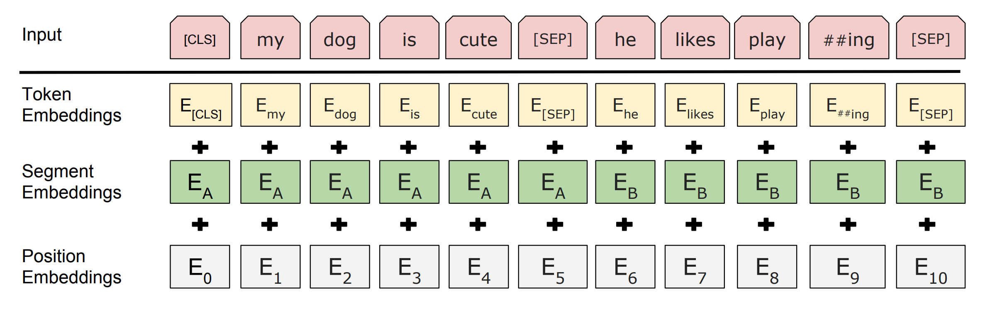

## 1. Bert

### 1.1 what Bert is

BERT (Bidirectional Encoder Representations from Transformers) is a Transformer's bidirectional encoder, which aims to pre-train deep bidirectional representations from unlabeled text through conditional calculations shared in the left and right contexts. Therefore, the pre-trained BERT model can be fine-tuned with an additional output layer to generate the latest models for various natural language processing tasks.

This is what we often say [pre-training] + [fine tuning].

### 1.2 three key points

#### 1.2.1 pre-training base on a large text corpus

Pre-training in a large text corpus containing the entire Wikipedia unlabeled text (full 2.5 billion words!) and a book corpus (800 million words).

#### 1.2.2 bidirectional model

Bert is a "deep bidirectional model" which means that it can draw information from the left and right context of the selected text during the training phase.

#### 1.2.3 Based on transformer structure

### 1.3 input representation

For a given token, its input representation is constructed by summing the corresponding token, segment, and position embeddings. 

### 1.4 pre-train task

#### 1.4.1 Masked LM

In order to train a deep bidirectional representation, we simply mask some percentage of the input tokens at random, and then predict those masked tokens.  We refer to this procedure as a “masked LM” (MLM), although it is often referred to as a Cloze task in the literature. In this case, the final hidden vectors corresponding to the mask tokens are fed into an output softmax over the vocabulary, as in a standard LM. In all of our experiments, we mask 15% of all WordPiece tokens in each sequence at random.

#### 1.4.2 Next Sentence Prediction

In order to train a model that understands sentence relationships, we pre-train for a binarized next sentence prediction task that can be trivially generated from any monolingual corpus. Specifically, when choosing the sentences A and B for each pretraining example, 50% of the time B is the actual next sentence that follows A (labeled as IsNext), and 50% of the time it is a random sentence from the corpus (labeled as NotNext).

### 1.5 fine-turning

Fine-tuning is straightforward since the self-attention mechanism in the Transformer allows BERT to model many downstream tasks — whether they involve single text or text pairs — by swapping out the appropriate inputs and outputs. BERT instead uses the self-attention mechanism to unify these two stages, as encoding a concatenated text pair with self-attention effectively includes bidirectional cross attention between two sentences. For each task, we simply plug in the task-specific inputs and outputs into BERT and finetune all the parameters end-to-end.

## 2. Practice

[Sample given by Datawhale](https://tianchi.aliyun.com/notebook-ai/detail?spm=5176.12586969.1002.6.6406111aFLdc6o&postId=118260) 

my practice: working on it...

## 3. References

##### 1. [google_research_bert](https://github.com/google-research/bert) 

##### 2. [BERT: Pre-training of Deep Bidirectional Transformers for Language Understanding](https://arxiv.org/pdf/1810.04805.pdf) 

